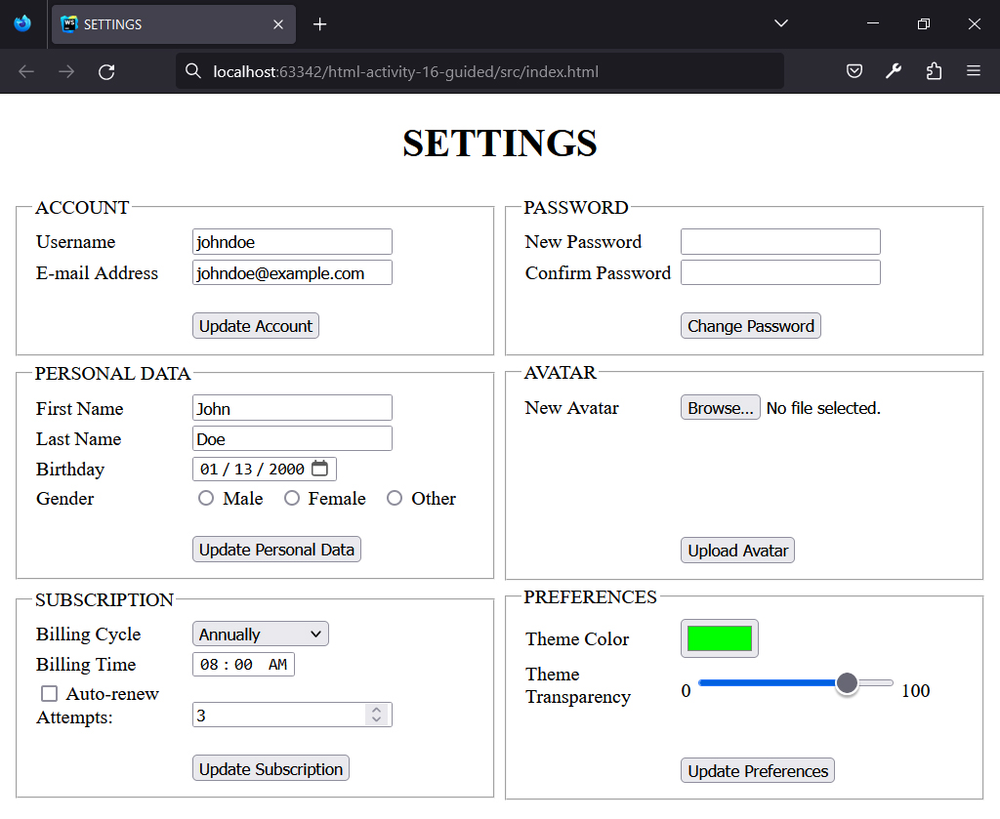
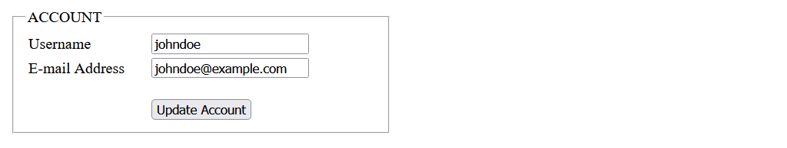
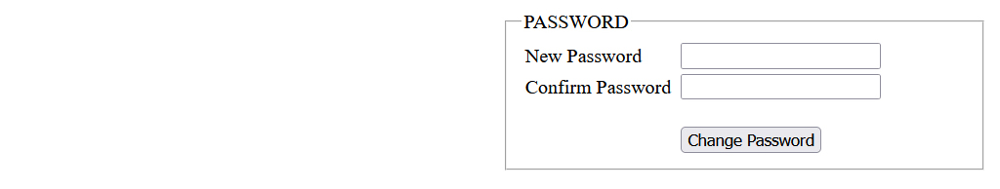
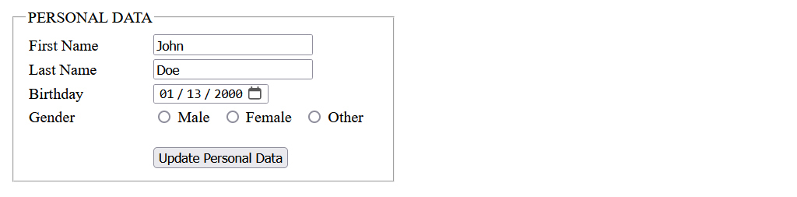
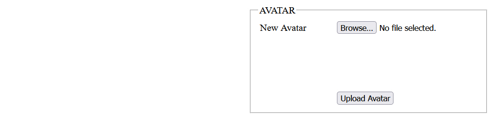
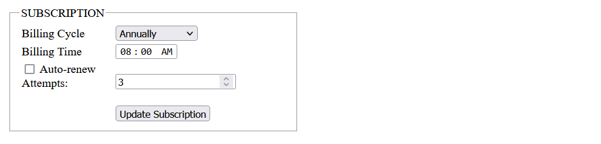
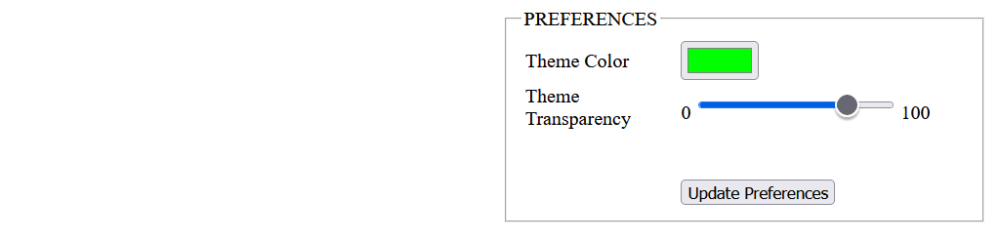

## HTML | Activity #16 (Guided): Forms (Part 2)
In this activity, we will create a **Settings Page** with the following content:



### Development Setup
Create your `index.html` file inside the [**src**](/src) folder in this project,
then follow along with this guide.

To test your output, simply open it in your preferred web browser.


### Template
First, we need a regular HTML template that already contains relevant texts.

We are still going to use a tabular layout for this page:

```html
<!DOCTYPE html>
<html lang="en">
<head>
    <meta charset="UTF-8">
    <title>SETTINGS</title>
</head>
<body>
<h1 align="center">SETTINGS</h1>
<table width="100%">
    <tr>
        <td width="50%">

            <!-- ACCOUNT -->

        </td>

        <td width="50%">

            <!-- PASSWORD -->
            
        </td>
    </tr>
    <tr>
        <td width="50%">

            <!-- PERSONAL DATA -->

        </td>
        
        <td width="50%">

            <!-- AVATAR -->

        </td>
    </tr>
    <tr>
        <td width="50%">
            
            <!-- SUBSCRIPTION -->

        </td>

        <td width="50%">

            <!-- PREFERENCES -->

        </td>
    </tr>
</table>
</body>
</html>
```


### Creating the Forms
Each section of the **SETTINGS** is an independent `<form>` organized in a fieldset.
In HTML, a fieldset, defined by the `<fieldset>` tag,
is used to group related form elements together.
It creates a visual grouping or boundary for the elements within it.

Inside the fieldset, the `<legend>` tag is used to provide a caption
or description for the group of form elements.
It typically appears as a title or heading above the related elements,
helping users understand the purpose or context of the grouped elements.

---

#### 1. ACCOUNT Form


The **ACCOUNT Form** contains `"text"` and `"email"` inputs
for capturing the user's **Username** and **E-mail Address**, respectively.
These two input fields already have a predefined `value`.

```html
            ...
            
            <!-- ACCOUNT -->
            <form>
                <fieldset>
                    <legend>ACCOUNT</legend>
                    <table width="100%">
                        <!-- ACCOUNT | Username -->
                        <tr>
                            <td width="35%">
                                <label for="username">Username</label>
                            </td>
                            <td>
                                <input
                                    type="text"
                                    id="username"
                                    value="johndoe"
                                />
                            </td>
                        </tr>
            
                        <!-- ACCOUNT | E-mail Address -->
                        <tr>
                            <td width="35%">
                                <label for="email">E-mail Address</label>
                            </td>
                            <td>
                                <input
                                    type="text"
                                    id="email"
                                    value="johndoe@example.com"
                                />
                            </td>
                        </tr>
            
                        <!-- ACCOUNT | Update Account Button -->
                        <tr>
                            <td></td>
                            <td>
                                <br/>
                                <button>Update Account</button>
                            </td>
                        </tr>
                    </table>
                </fieldset>
            </form>
            
            ...
```

---

#### 2. PASSWORD Form


The **PASSWORD Form** contains two `"password"` inputs
for capturing the **New Password** and its **Confirmation**.
A **password input** is a type of input field that masks
the entered characters to enhance security and privacy.

```html
            ...
            
            <!-- PASSWORD -->
            <form>
                <fieldset>
                    <legend>PASSWORD</legend>
                    <table width="100%">
                        <!-- PASSWORD | New Password -->
                        <tr>
                            <td width="35%">
                                <label for="new-password">
                                    New Password
                                </label>
                            </td>
                            <td>
                                <input
                                    type="password"
                                    id="new-password"
                                />
                            </td>
                        </tr>
            
                        <!-- PASSWORD | Confirm Password -->
                        <tr>
                            <td width="35%">
                                <label for="confirm-password">
                                    Confirm Password
                                </label>
                            </td>
                            <td>
                                <input
                                    type="password"
                                    id="confirm-password"
                                />
                            </td>
                        </tr>
            
                        <!-- PASSWORD | Change Password Button -->
                        <tr>
                            <td></td>
                            <td>
                                <br/>
                                <button>Change Password</button>
                            </td>
                        </tr>
                    </table>
                </fieldset>
            </form>
            
            ...
```

---

#### 3. PERSONAL DATA Form


The **PERSONAL DATA Form** contains two `"text"` inputs
for capturing the **First Name** and **Last Name**,
a `"date"` input for the **Birthday**,
and three `"radio"` buttons for selecting the **Gender**.

```html
            ...
            
            <!-- PERSONAL DATA -->
            <form>
                <fieldset>
                    <legend>PERSONAL DATA</legend>
                    <table width="100%">
                        <!-- PERSONAL DATA | First Name -->
                        <tr>
                            <td width="35%">
                                <label for="first-name">First Name</label>
                            </td>
                            <td>
                                <input
                                    type="text"
                                    id="first-name"
                                    value="John"
                                />
                            </td>
                        </tr>
            
                        <!-- PERSONAL DATA | Last Name -->
                        <tr>
                            <td width="35%">
                                <label for="last-name">Last Name</label>
                            </td>
                            <td>
                                <input
                                    type="text"
                                    id="last-name"
                                    value="Doe"
                                />
                            </td>
                        </tr>
            
                        <!-- PERSONAL DATA | Birthday -->
                        <tr>
                            <td width="35%">
                                <label for="birthday">Birthday</label>
                            </td>
                            <td>
                                <input
                                    type="date"
                                    id="birthday"
                                    value="2000-01-13"
                                />
                            </td>
                        </tr>
            
                        <!-- PERSONAL DATA | Gender -->
                        <tr>
                            <td width="35%">
                                <label>Gender</label>
                            </td>
                            <td>
                                <input
                                    type="radio"
                                    name="gender"
                                    id="gender-male"
                                />
                                <label for="gender-male">Male</label>
                                &nbsp;
                                <input
                                    type="radio"
                                    name="gender"
                                    id="gender-female"
                                />
                                <label for="gender-female">Female</label>
                                &nbsp;
                                <input
                                    type="radio"
                                    name="gender"
                                    id="gender-other"
                                />
                                <label for="gender-other">Other</label>
                            </td>
                        </tr>
            
                        <!-- PERSONAL DATA | Update Personal Data Button -->
                        <tr>
                            <td></td>
                            <td>
                                <br/>
                                <button>Update Personal Data</button>
                            </td>
                        </tr>
                    </table>
                </fieldset>
            </form>
            
            ...
```

---

#### 4. AVATAR Form


The **AVATAR Form** includes a file input for uploading a file.

```html
            ...
            
            <!-- AVATAR -->
            <form>
                <fieldset>
                    <legend>AVATAR</legend>
                    <table width="100%">
                        <!-- AVATAR | New Avatar -->
                        <tr>
                            <td width="35%">
                                <label for="avatar">New Avatar</label>
                            </td>
                            <td>
                                <input type="file" id="avatar"/>
                            </td>
                        </tr>
            
                        <!-- AVATAR | Upload Avatar Button -->
                        <tr>
                            <td></td>
                            <td>
                                <br/>
                                <br/>
                                <br/>
                                <br/>
                                <br/>
                                <button>Upload Avatar</button>
                            </td>
                        </tr>
                    </table>
                </fieldset>
            </form>
            
            ...
```

---

#### 5. SUBSCRIPTION Form


The **SUBSCRIPTION Form** contains a dropdown list for selecting the **Billing Cycle**,
a `"time"` input for capturing the **Billing Time**,
a "`checkbox`" to enable/disable **auto-renewal**,
and a `"number"` input for specifying the number of **auto-renewal attempts**.

```html
            ...
            
            <!-- SUBSCRIPTION -->
            <form>
                <fieldset>
                    <legend>SUBSCRIPTION</legend>
                    <table width="100%">
            
                        <!-- SUBSCRIPTION | Billing Cycle -->
                        <tr>
                            <td width="35%">
                                <label for="billing-cycle">
                                    Billing Cycle
                                </label>
                            </td>
                            <td>
                                <select id="billing-cycle">
                                    <option>Quarterly</option>
                                    <option>Semi-annually</option>
                                    <option selected>Annually</option>
                                </select>
                            </td>
                        </tr>
            
                        <!-- SUBSCRIPTION | Billing Time -->
                        <tr>
                            <td width="35%">
                                <label for="billing-time">
                                    Billing Time
                                </label>
                            </td>
                            <td>
                                <input
                                    type="time"
                                    id="billing-time"
                                    value="08:00"
                                />
                            </td>
                        </tr>
            
                        <!-- SUBSCRIPTION | Auto-renew -->
                        <tr>
                            <td width="35%">
                                <input type="checkbox" id="auto-renew" />
                                <label for="auto-renew">Auto-renew</label>
                                <br/>
                                <label for="billing-attempts">Attempts:</label>
                            </td>
                            <td valign="bottom">
                                <input
                                    type="number"
                                    id="billing-attempts"
                                    value="3"
                                />
                            </td>
                        </tr>
            
                        <!-- SUBSCRIPTION | Update Subscription Button -->
                        <tr>
                            <td></td>
                            <td>
                                <br/>
                                <button>Update Subscription</button>
                            </td>
                        </tr>
                    </table>
                </fieldset>
            </form>
            
            ...
```

---

#### 6. PREFERENCES Form


The **PREFERENCES Form** includes a `"color"` input
for selecting the user's **Theme Color**
and a `"range"` input for adjusting its **transparency**.

```html
            ...
            
            <!-- PREFERENCES -->
            <form>
                <fieldset>
                    <legend>PREFERENCES</legend>
                    <table width="100%">
            
                        <!-- PREFERENCES | Theme Color -->
                        <tr>
                            <td width="35%">
                                <label for="theme-color">
                                    Theme Color
                                </label>
                            </td>
                            <td>
                                <input
                                    type="color"
                                    id="theme-color"
                                    value="#00ff00"
                                />
                            </td>
                        </tr>
            
                        <!-- PREFERENCES | Theme Transparency -->
                        <tr>
                            <td width="35%">
                                <label for="theme-transparency">
                                    Theme Transparency
                                </label>
                            </td>
                            <td>
                                0
                                <input
                                    type="range"
                                    id="theme-transparency"
                                    min="1"
                                    max="100"
                                    value="80"
                                />
                                100
                            </td>
                        </tr>
            
                        <!-- PREFERENCES | Update Preferences Button -->
                        <tr>
                            <td></td>
                            <td>
                                <br/>
                                <br/>
                                <button>Update Preferences</button>
                            </td>
                        </tr>
                    </table>
                </fieldset>
            </form>
            
            ...
```
